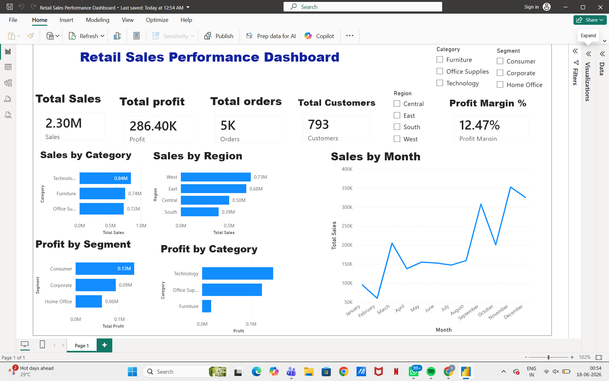

# Retail Sales Performance Dashboard

## Project Overview

Built an end-to-end Retail Sales Analytics Dashboard using SQL Server and Power BI to analyze sales, profit, customer behavior, and regional performance.

## Tools Used

* SQL Server
* Power BI
* DAX
* Excel (Sample Superstore Dataset)

## Business Problem

The objective was to identify:

* Top-performing categories
* Most profitable regions
* Best customer segments
* Sales trends over time
* Impact of discounts on profitability

## Dashboard KPIs

* Total Sales
* Total Profit
* Total Orders
* Total Customers
* Profit Margin %

## Key Insights

* Technology generated the highest sales and profit.
* Furniture generated the lowest profit.
* West region was the strongest performing region.
* Consumer segment generated the highest profit.
* High discounts negatively impacted profitability.
* November and December were peak sales months.

## Power BI Features

* KPI Cards
* DAX Measures
* Interactive Slicers
* Category Analysis
* Region Analysis
* Segment Analysis
* Monthly Sales Trend Analysis

## Dashboard Preview

